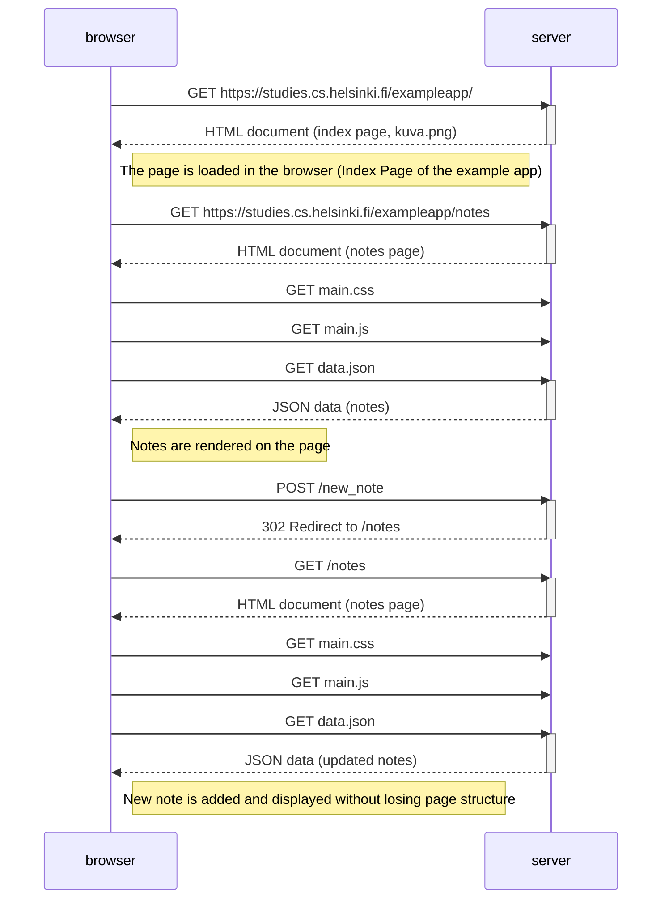

```mermaid
sequenceDiagram
    participant browser
    participant server

    browser->>server: GET https://studies.cs.helsinki.fi/exampleapp/
    activate server
    server-->>browser: HTML document (index page, kuva.png)
    deactivate server
    Note right of browser: The page is loaded in the browser (Index Page of the example app)

    browser->>server: GET https://studies.cs.helsinki.fi/exampleapp/notes
    activate server
    server-->>browser: HTML document (notes page)
    deactivate server

    browser->>server: GET main.css
    browser->>server: GET main.js
    browser->>server: GET data.json
    activate server
    server-->>browser: JSON data (notes)
    deactivate server
    Note right of browser: Notes are rendered on the page

    browser->>server: POST /new_note
    activate server
    server-->>browser: 302 Redirect to /notes
    deactivate server

    browser->>server: GET /notes
    activate server
    server-->>browser: HTML document (notes page)
    deactivate server

    browser->>server: GET main.css
    browser->>server: GET main.js
    browser->>server: GET data.json
    activate server
    server-->>browser: JSON data (updated notes)
    deactivate server
    Note right of browser: New note is added and displayed without losing page structure

```
