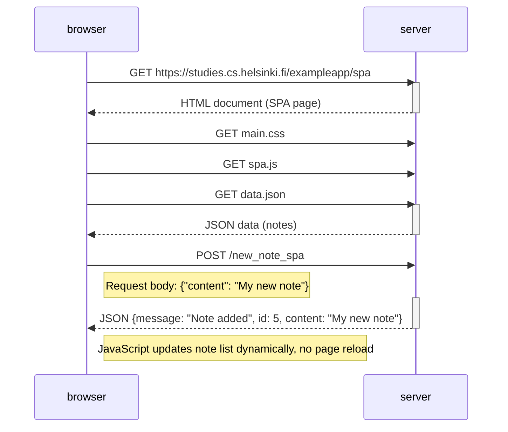

```mermaid
sequenceDiagram
    participant browser
    participant server
    browser->>server: GET https://studies.cs.helsinki.fi/exampleapp/spa
    activate server
    server-->>browser: HTML document (SPA page)
    deactivate server

    browser->>server: GET main.css
    browser->>server: GET spa.js

    browser->>server: GET data.json
    activate server
    server-->>browser: JSON data (notes)
    deactivate server


    browser->>server: POST /new_note_spa
    Note right of browser: Request body: {"content": "My new note"}
    activate server
    server-->>browser: JSON {message: "Note added", id: 5, content: "My new note"}
    deactivate server
    Note right of browser: JavaScript updates note list dynamically, no page reload

```